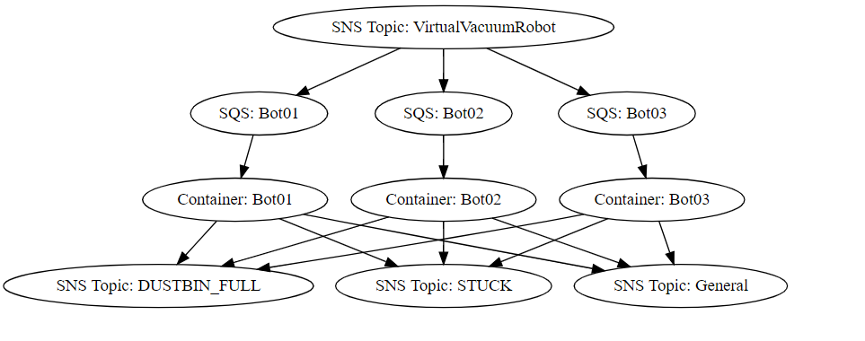

# Virtual Vacuum Robot

A simple vacuum robot to test out swarm intelligence : https://en.wikipedia.org/wiki/Swarm_intelligence

## Prerequisites

- Docker https://www.docker.com/
- Docker compose

## Getting Started

Create a `docker-compose.yml` file with the AWS credentials

```yml
version: "3"
services:
  vvr:
    image: skittleson/virtualvacuumrobot
    environment:
      - AWS_ACCESS_KEY_ID=REPLACEME
      - AWS_SECRET_ACCESS_KEY=REPLACEME
      - AWS_REGION=us-east-1
```

Spin up 3 instances with: `docker-compose up --scale vvr=3`

### Publish SNS json messages to control the vacuum(s):

- Start cleaning: `{'action':'start'}`
- Stop cleaning: `{'action':'stop'}`
- Charge: `{'action':'charge'}`
- Clear dustbin: `{'action':'dustbin'}`
- Status: `{'action':'status'}`
- Shutdown: `{'action':'shutdown'}`
- Teardown: `{'action':'teardown'}` Removes all SNS topics and Queues for virtual vacuums

Control a single vacuum by sending the id:
Start cleaning: `{'action':'start', 'id': '1234'}`

Receive messages on SNS topics:

- VirtualVacuumRobot_DUSTBIN_FULL
- VirtualVacuumRobot_General
- VirtualVacuumRobot_STUCK



## Development

- Copy **VirtualVacuumRobot\docker-compose.yml.dist** to **VirtualVacuumRobot\docker-compose.yml**
- Update **VirtualVacuumRobot\docker-compose.yml** AWS environment variables with credentials that have access to SNS and SQS.
- Build & run the docker compose command: `docker-compose up --scale vvr=3 --build` .
  To tear down: `docker-compose down`.

or use `dotnet run`

## Running the tests

`dotnet test`

## Built With

- [dotnet core](https://dotnet.microsoft.com/download)
- [docker](https://www.docker.com/) - Docker
- [xunit](https://rometools.github.io/rome/) - Unit testing
